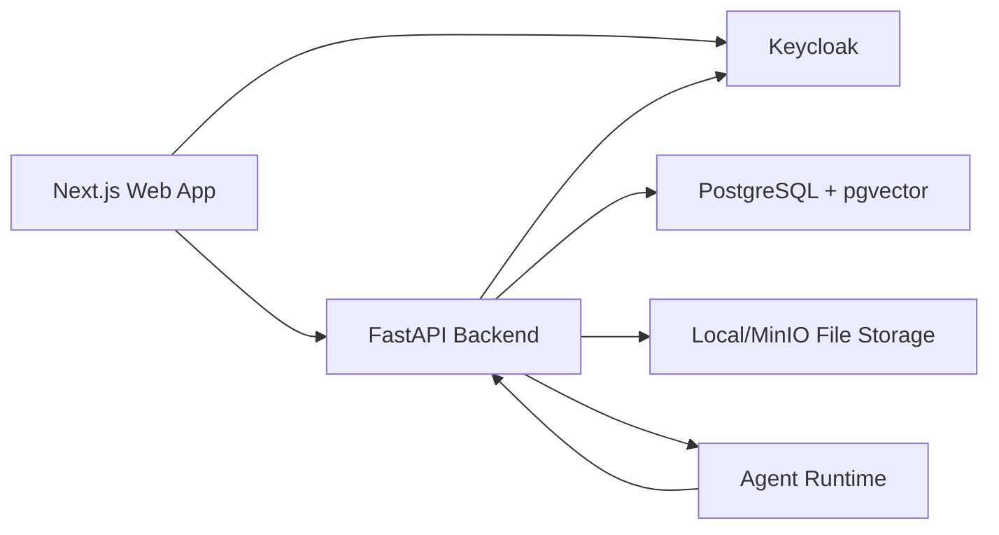

# AI Institution Operating System Design Plan

## 1. Goal

Build a simple open-source MVP for an AI-powered institution operating system. The first version should help an institution manage students, attendance, fees, timetable, exams, communication, and basic AI assistance without heavy infrastructure or unnecessary abstractions.

## 2. Simplicity Rules

- Start with one frontend app and one backend app.
- Keep modules separate in folders, not separate services.
- Use REST APIs first. Add GraphQL only if the UI later needs it.
- Use PostgreSQL for primary data, search, JSON metadata, and embeddings through `pgvector`.
- Avoid Kubernetes, OpenSearch, Kafka, plugin marketplace, and complex workflow engines in the MVP.
- Build one working vertical slice before expanding every module.
- Agents are separate by domain, but they run inside one agent runtime.

## 3. MVP Open-Source Stack

### Frontend

- Next.js.
- React.
- Tailwind CSS.
- shadcn/ui or Radix UI.
- TanStack Query.
- React Hook Form and Zod.
- i18next for translations.

### Backend

- Python FastAPI.
- SQLAlchemy.
- Alembic.
- Pydantic.
- PostgreSQL.
- Optional Redis only for background jobs or caching when needed.

### AI

- LangGraph for agent flows.
- Ollama for local model serving.
- Open-source models such as Llama, Qwen, or DeepSeek.
- `pgvector` for simple retrieval and semantic search.

### Auth And Operations

- Keycloak for login, roles, and MFA.
- Docker Compose for local development.
- Basic structured logs.
- Prometheus and Grafana can be added after the MVP has real usage.

## 4. Simple Architecture



The backend stays the source of truth. Agents do not change data directly unless they call approved backend functions.

## 5. Codebase Layout

```text
apps/
  web/                  Next.js frontend
services/
  api/                  FastAPI backend
  agents/               LangGraph agents and tools
packages/
  shared/               Shared generated types and constants
infra/
  docker-compose.yml    Local PostgreSQL, Keycloak, and optional Redis
docs/
  source-requirements.md
  design-plan.md
  decisions/
```

This keeps UI and backend code separate while avoiding too many packages before the product has stabilized.

## 6. MVP Modules And Agents

Each module has:

- Frontend screens in `apps/web`.
- Backend routes and database models in `services/api`.
- Optional agent logic in `services/agents`.

### 6.1 Academic Agent

MVP scope:

- Students.
- Classes and sections.
- Attendance.
- Timetable.
- Exams and marks.

Agent jobs:

- Summarize student attendance and performance.
- Flag students who may need attention.
- Help staff search academic records.

### 6.2 Finance Agent

MVP scope:

- Fee plans.
- Student invoices.
- Payments.
- Due lists.

Agent jobs:

- Summarize dues.
- Explain a student fee ledger.
- Suggest follow-up messages for overdue payments.

### 6.3 HR Agent

MVP scope:

- Staff profiles.
- Roles.
- Leave requests.

Agent jobs:

- Summarize staff availability.
- Draft simple internal notices.

### 6.4 Parent Communication Agent

MVP scope:

- Parent contacts.
- Message templates.
- Announcements.
- Delivery status.

Agent jobs:

- Draft parent messages.
- Translate messages into supported languages.
- Summarize communication history.

### 6.5 Compliance Agent

MVP scope:

- Audit logs.
- Important documents.
- Basic compliance checklists.

Agent jobs:

- Summarize missing checklist items.
- Answer questions from approved policy documents.

### 6.6 Analytics Agent

MVP scope:

- Attendance dashboard.
- Fee collection dashboard.
- Exam performance dashboard.

Agent jobs:

- Explain dashboard numbers.
- Create weekly summaries.
- Highlight unusual changes.

## 7. Database Starter Tables

Start with a compact schema:

- tenants.
- users.
- roles.
- students.
- guardians.
- staff.
- classes.
- sections.
- attendance_records.
- timetables.
- exams.
- exam_results.
- fee_plans.
- invoices.
- payments.
- messages.
- documents.
- audit_logs.
- ai_conversations.
- ai_tool_calls.

Use JSONB columns only where configuration must be flexible. Avoid building a large metadata engine before the core product works.

## 8. API Plan

Use REST for the MVP.

Example routes:

- `GET /api/students`
- `POST /api/students`
- `POST /api/attendance`
- `GET /api/fees/dues`
- `POST /api/payments`
- `POST /api/messages/draft`
- `POST /api/agents/academic/chat`
- `POST /api/agents/finance/chat`

API rule:

- Backend owns validation.
- Frontend uses generated types where practical.
- Keep routes readable and module-based.

## 9. Frontend Plan

Build the first screen as the actual app, not a marketing page.

Primary navigation:

- Dashboard.
- Students.
- Attendance.
- Timetable.
- Exams.
- Fees.
- Staff.
- Messages.
- Analytics.
- Settings.

Build order:

1. Login and app layout.
2. Student list and student profile.
3. Attendance marking.
4. Fee ledger and payment entry.
5. Timetable.
6. Exams and marks.
7. Message composer.
8. Basic AI assistant side panel.
9. Dashboards.

## 10. Backend Plan

Recommended layout:

```text
services/api/
  app/
    main.py
    core/
      config.py
      auth.py
      tenancy.py
      audit.py
    modules/
      students/
      attendance/
      fees/
      timetable/
      exams/
      staff/
      messages/
      analytics/
    db/
      models.py
      migrations/
```

Build order:

1. Health check, database connection, migrations.
2. Auth and tenant context.
3. Students.
4. Attendance.
5. Fees.
6. Timetable.
7. Exams.
8. Messages.
9. Agent endpoints.
10. Dashboards.

## 11. Agent Runtime Plan

Recommended layout:

```text
services/agents/
  app/
    main.py
    registry.py
    agents/
      academic.py
      finance.py
      hr.py
      parent_communication.py
      compliance.py
      analytics.py
    tools/
      academic_tools.py
      finance_tools.py
      message_tools.py
      analytics_tools.py
```

Keep agents simple:

- One agent per module.
- Each agent has a small list of approved tools.
- Agents call backend APIs or service functions.
- Log every agent request, tool call, and response.
- Require human approval before sending messages or changing important records.

## 12. Multilingual Plan

MVP support:

- English first.
- Add Telugu and Hindi next.
- Add Tamil, Kannada, Malayalam, Arabic, French, and Spanish after the main workflows are stable.

Implementation:

- Use i18next for UI labels.
- Store parent message templates by language.
- Use AI translation for draft messages, with human review before sending.
- Add right-to-left layout support before Arabic launch.

## 13. Security Plan

Keep security strong but understandable:

- Keycloak login.
- Role-based access control.
- Tenant ID on every tenant-owned record.
- Server-side tenant checks on every request.
- Audit log for important actions.
- TLS in production.
- Do not put sensitive data in logs.
- Agents only see data the user is allowed to see.

## 14. What To Add Later

Only add these when the MVP proves the need:

- GraphQL.
- Kubernetes.
- OpenSearch.
- Kafka or Redpanda.
- Full plugin marketplace.
- Advanced metadata engine.
- Advanced workflow builder.
- Prometheus, Grafana, Loki, and OpenTelemetry.
- Separate microservices.

## 15. MVP Delivery Plan

### Phase 1: Foundation

- Monorepo setup.
- Docker Compose with PostgreSQL and Keycloak.
- FastAPI backend.
- Next.js frontend.
- Auth and tenant context.
- Student management.

### Phase 2: Core ERP

- Attendance.
- Fees.
- Timetable.
- Exams.
- Staff basics.

### Phase 3: Communication And AI

- Parent message composer.
- AI assistant side panel.
- Academic Agent.
- Finance Agent.
- Parent Communication Agent.

### Phase 4: Dashboards And Remaining Agents

- Attendance dashboard.
- Fee dashboard.
- Exam dashboard.
- HR Agent.
- Compliance Agent.
- Analytics Agent.

## 16. Immediate Next Steps

1. Scaffold the monorepo folders.
2. Add Docker Compose for PostgreSQL and Keycloak.
3. Scaffold FastAPI with health check and database migrations.
4. Scaffold Next.js with app shell and login.
5. Build student management as the first complete vertical slice.
6. Add attendance as the second vertical slice.
7. Add the Academic Agent only after student and attendance data exist.
